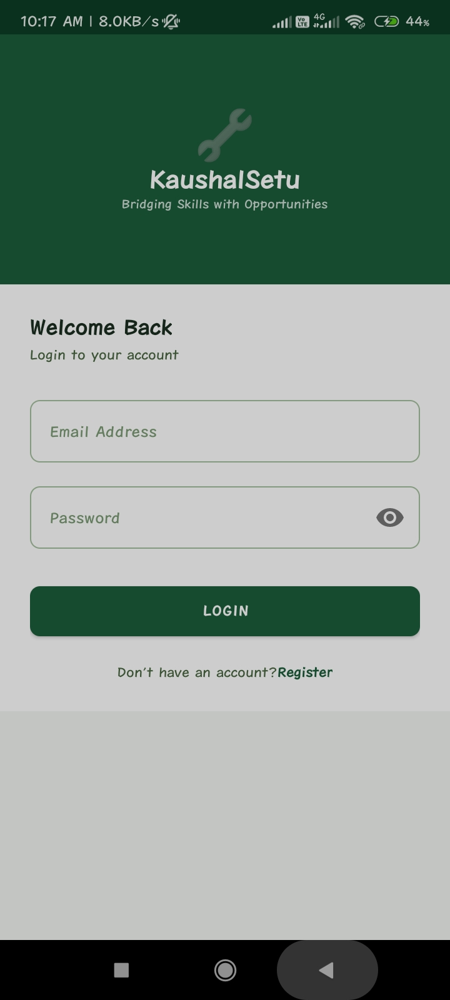
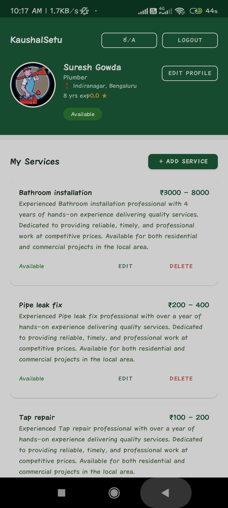
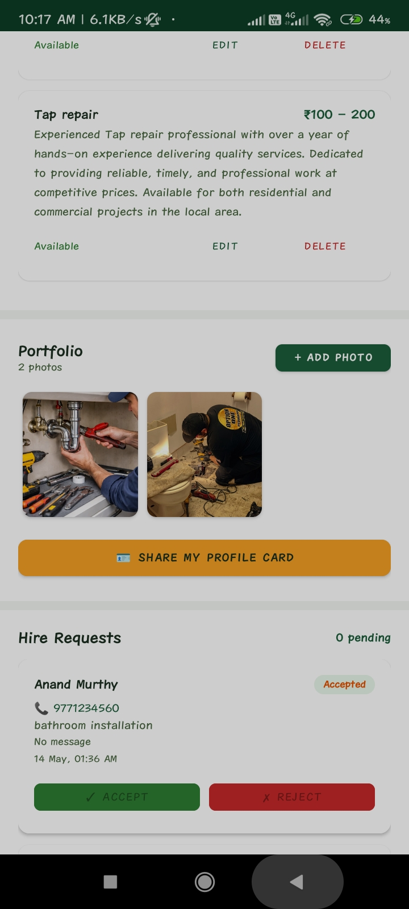
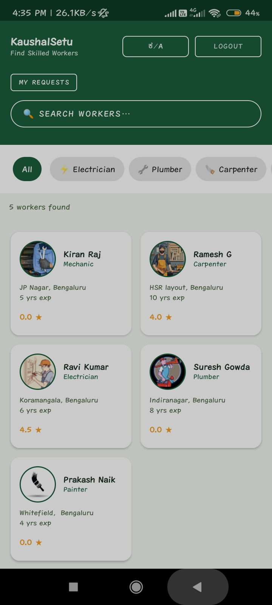
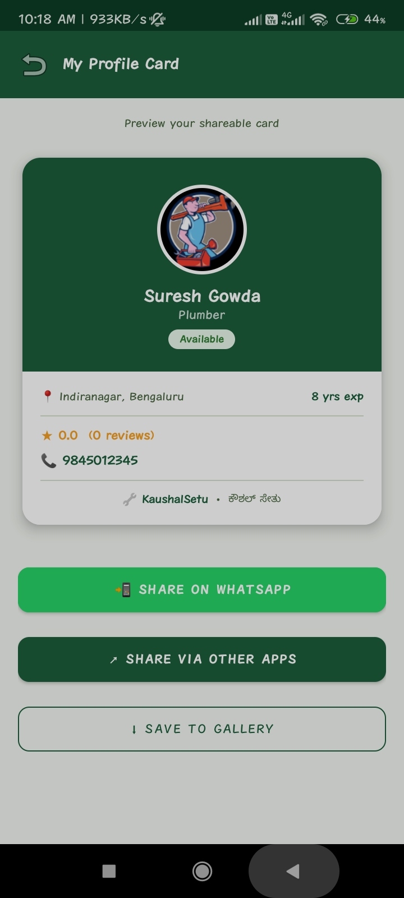

# KaushalSetu 🔧
### Hyperlocal Skill Showcase Platform for Blue-Collar Workers
 
> **ಕೌಶಲ್ ಸೇತು — Bridging Skills with Opportunities**


[](https://android.com)
[](https://kotlinlang.org)
[](https://firebase.google.com)
[](https://aistudio.google.com)
[](LICENSE)


---
 
## 📋 Problem Statement
 
In many small towns and semi-urban areas of Karnataka, skilled workers such as electricians, plumbers, carpenters, painters, and mechanics depend entirely on word-of-mouth referrals to find work. They have no digital presence, no way to showcase their skills, and no platform to build a reputation.
 
Customers in new areas struggle to find trusted local workers with transparent pricing. Existing platforms like Urban Company operate only in Tier-1 cities. A plumber in Hubli or an electrician in Dharwad has zero digital presence today.
 
**KaushalSetu solves this** by giving workers their own digital identity — profile, portfolio, services, and reviews — while helping customers discover and hire reliable workers nearby, in their own language.
 
> **Note:** This project was submitted as **KaushalSetu** — a rebranded version of the original problem statement *"Kaushalya-Karnataka – Hyperlocal Skill Showcase Platform for Blue-Collar Workers"*. All functional requirements FR1–FR8 from the original PRD are fully implemented.
 
---
 
## ✨ Features
 
### Worker Features
- 🔐 **Register / Login** — Email and password authentication with role selection
- 👤 **Profile Setup** — Name, skill category, experience, location, bio, profile photo
- 🛠️ **Service Cards** — Add, edit, and delete services with name, price, and description
- 🤖 **AI Description Generator** — Gemini API generates professional service descriptions instantly
- 🖼️ **Portfolio Upload** — Upload photos of completed work, displayed in a 3-column grid
- 🪪 **Shareable Profile Card** — Generate a PNG card and share via WhatsApp or other apps
- 📋 **Hire Request Management** — View, accept, or reject incoming hire requests
- 🌐 **Kannada / English Toggle** — Bilingual support with one-tap language switch
### Customer Features
- 🔍 **Browse Workers** — See all available workers with category filter chips
- 📍 **Search by Location** — Find workers in a specific area
- 👷 **Worker Detail View** — Full profile, portfolio grid, services, and reviews
- 📩 **Send Hire Request** — Contact a worker with service details and message
- 📊 **Track Request Status** — See Pending / Accepted / Rejected status for all sent requests
- ⭐ **Rate and Review** — Leave star ratings and written reviews after service
---
 
## 🛠️ Tech Stack
 
| Component | Technology | Purpose |
|---|---|---|
| Language | Kotlin | Primary Android development |
| Architecture | MVVM + ViewModel + Repository | Separation of concerns |
| UI | XML Layouts + Material Design 3 | Forest Green + Amber theme |
| Authentication | Firebase Authentication | Email/password, role-based routing |
| Database | Firebase Firestore | Real-time NoSQL database |
| Storage | Firebase Storage | Profile photos and portfolio images |
| AI Integration | Gemini 1.5 Flash API | AI service description generator |
| Image Loading | Glide | Efficient image loading and caching |
| Async | Kotlin Coroutines | Non-blocking Firebase operations |
| View Access | ViewBinding | Type-safe view references |
| Localisation | strings.xml (EN + KN) | Kannada and English runtime switching |
| Version Control | Git + GitHub | Source control and CI/CD |
 
---
 
## 📁 Folder Structure
 
```
KaushalSetu/
├── app/
│   ├── build.gradle                        ← app dependencies and build config
│   ├── google-services.json                ← Firebase config (not committed — see setup)
│   └── src/main/
│       ├── AndroidManifest.xml             ← all activities registered here
│       ├── java/com/kaushal/setu/
│       │   ├── KaushalSetuApp.kt           ← Application class, locale init
│       │   ├── data/
│       │   │   ├── model/                  ← User, WorkerProfile, ServiceCard,
│       │   │   │                              Review, HireRequest, ChatMessage
│       │   │   └── repository/             ← AuthRepository, WorkerRepository,
│       │   │                                  GeminiRepository
│       │   ├── viewmodel/                  ← AuthViewModel, WorkerViewModel
│       │   ├── ui/
│       │   │   ├── auth/                   ← SplashActivity, LoginActivity,
│       │   │   │                              RegisterActivity
│       │   │   ├── worker/                 ← WorkerDashboardActivity,
│       │   │   │                              ProfileSetupActivity,
│       │   │   │                              AddServiceActivity,
│       │   │   │                              ProfileCardActivity
│       │   │   ├── customer/               ← CustomerDashboardActivity,
│       │   │   │                              SearchActivity,
│       │   │   │                              WorkerDetailActivity,
│       │   │   │                              HireRequestHistoryActivity
│       │   │   └── common/                 ← BaseActivity, all Adapters,
│       │   │                                  LanguageSettingsActivity
│       │   └── utils/                      ← LocaleHelper, Extensions
│       └── res/
│           ├── layout/                     ← 15 activity + 6 item layouts
│           ├── drawable/                   ← shapes, icons, backgrounds
│           ├── color/                      ← color state lists
│           ├── values/                     ← colors, strings (English), themes
│           ├── values-kn/                  ← strings (Kannada)
│           └── xml/                        ← file_paths, backup_rules
├── .gitignore
├── build.gradle
├── settings.gradle
└── README.md
```
---
## 📸 Screenshots
 
<table>
<tr>
<th>Login</th>
<th>Worker Dashboard(1)</th>
<th>Worker Dashboard(2)</th>
<th>Customer Browse</th>
<th>Profile Card</th>
</tr>

<tr>
<td></td>
<td></td>
<td></td>
<td></td>
<td></td>
</tr>
</table>

---
 
## 🚀 Setup and Installation
 
### Prerequisites
- Android Studio Hedgehog (2023.1.1) or newer
- JDK 17
- Android SDK API 24–34
- A Google account (for Firebase)
### Step 1 — Clone the repository
 
```bash
git clone https://github.com/Lyynn777/KaushalSetu.git
cd KaushalSetu
```
 
### Step 2 — Firebase Setup
 
1. Go to [console.firebase.google.com](https://console.firebase.google.com)
2. Create a new project — name it `KaushalSetu`
3. Add Android app → package name: `com.kaushal.setu`
4. Download `google-services.json`
5. Place it in the `app/` folder
6. Enable the following services in Firebase Console:
   - **Authentication** → Sign-in method → Email/Password → Enable
   - **Firestore Database** → Create database → Start in test mode → Region: `asia-south1`
   - **Storage** → Get started → Test mode
**Firestore Security Rules** (paste in Firestore → Rules → Publish):
```
rules_version = '2';
service cloud.firestore {
  match /databases/{database}/documents {
    match /{document=**} {
      allow read, write: if request.auth != null;
    }
  }
}
```
 
**Storage Security Rules:**
```
rules_version = '2';
service firebase.storage {
  match /b/{bucket}/o {
    match /{allPaths=**} {
      allow read, write: if request.auth != null;
    }
  }
}
```
 
### Step 3 — API Key Setup
 
Create or open `local.properties` in the project root and add:
 
```properties
sdk.dir=YOUR_ANDROID_SDK_PATH
GEMINI_API_KEY=your_gemini_api_key_here
```
 
Get a free Gemini API key from [aistudio.google.com/app/apikey](https://aistudio.google.com/app/apikey)
 
> **Note:** The app works without the Gemini key — it falls back to a built-in offline mock description generator.
 
### Step 4 — Run the app
 
1. Open **Android Studio** → **File → Open** → select the `KaushalSetu` folder
2. Wait for Gradle sync to complete (2–5 minutes first time)
3. Run on emulator or physical device ▶
---
 ## 📱 Demo

> 📥 **Download APK:** [KaushalSetu-v1.0.apk](https://drive.google.com/file/d/110b8qwvfI0gyb-qBa_I8UbvScHBZyM8X/view?usp=sharing)

> 🚀 **GitHub Release:** [KaushalSetu v1.4.1](../../releases/latest)
---
 
## 🗄️ Database Schema (Firestore)
 
```
users/{uid}
  ├── uid, email, name, phone, userType
 
workers/{uid}
  ├── uid, name, phone, skillCategory, yearsOfExperience
  ├── location, bio, profileImageUrl, portfolioImages[]
  ├── averageRating, totalRatings, available
  └── services/{serviceId}
        └── id, serviceName, price, description, isAvailable
 
hire_requests/{id}
  └── id, workerUid, workerName, customerUid, customerName,
      customerPhone, serviceName, message, status, createdAt
 
reviews/{workerUid}/reviews/{id}
  └── id, workerUid, customerUid, customerName, rating, comment
```
 
---
 
## ✅ Functional Requirements Checklist
 
| ID | Requirement | Status |
|---|---|---|
| FR1 | User Registration / Login | ✅ Implemented |
| FR2 | Worker Profile Creation | ✅ Implemented |
| FR3 | Service Card Add / Edit / Delete | ✅ Implemented |
| FR4 | Portfolio Photo Upload | ✅ Implemented |
| FR5 | Customer Search by Category and Location | ✅ Implemented |
| FR6 | Ratings and Reviews | ✅ Implemented |
| FR7 | Hire Request Send and Manage | ✅ Implemented |
| FR8 | AI Service Description Generator | ✅ Implemented |
 
---
 
## 🌟 Features Beyond Original PRD
 
| Feature | Description |
|---|---|
| Kannada / English bilingual | Listed as future enhancement — fully built in v1 |
| Shareable Profile Card | Worker generates PNG card shareable on WhatsApp |
| BaseActivity locale system | Consistent language across all screens |
| FieldValue.arrayUnion | Atomic Firestore updates prevent portfolio data loss |
 
---
 
## 🔮 Future Enhancements
 
- 💬 In-app real-time chat after hire is accepted
- 💳 Online payments via Razorpay / UPI
- 🏅 Trust Score and badges (Rising Star, Trusted Pro, Elite)
- 📊 Earnings dashboard for workers
- 📅 Availability scheduling (set working days and hours)
- 🔔 Push notifications via Firebase Cloud Messaging
- 🎥 Video portfolio uploads
---
 
## 🔒 Security
 
- `google-services.json` is gitignored — never committed to source control
- Gemini API key stored in `local.properties` via `BuildConfig` — never hardcoded
- Firebase rules require authenticated users for all reads and writes
---
 
## 📄 License
 
MIT License — free to use, modify, and distribute.
 
---
